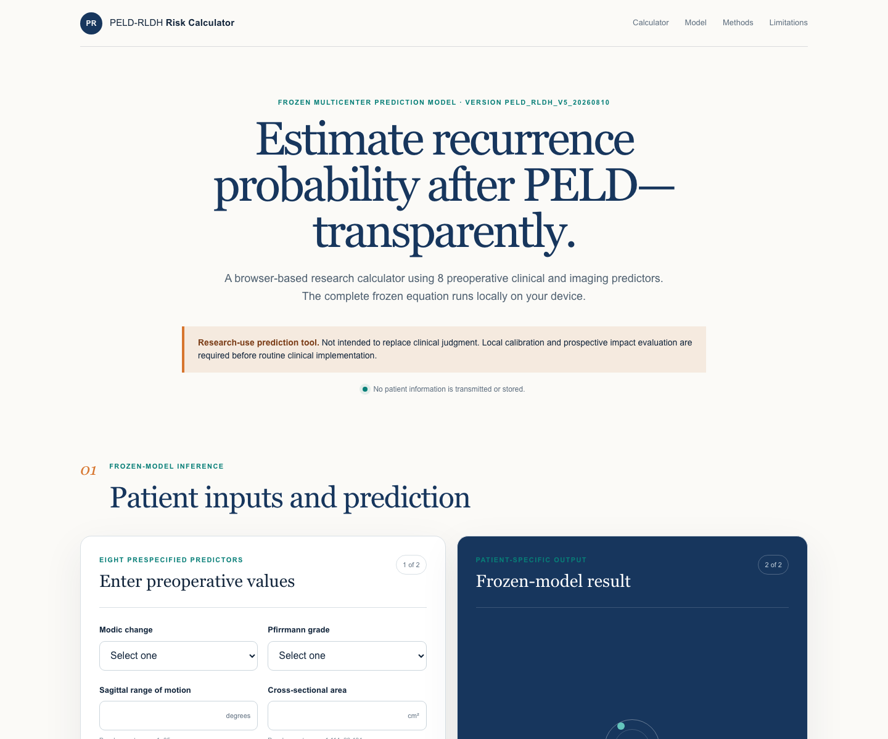

# PELD-RLDH browser calculator — core reproducibility release

> A browser-based research calculator implementing the frozen 8-predictor RCS Ridge model has been developed and independently verified against the reference Python implementation. The calculator performs all computations locally in the user's browser and does not transmit or store patient-entered information.

Online calculator: <https://hang0418.github.io/peld-rldh-risk-calculator/>

## Calculator interface



This repository publishes the minimum code needed to inspect the model-development
workflow and to reproduce, test, and serve the frozen browser equation. It does
not contain patient-level data, fitted model binaries, generated predictions,
development caches, or manuscript files.

## Published core files

| File | Purpose |
|---|---|
| `index.html` | Minimal eight-predictor browser interface |
| `app.js` | Local browser interaction and result rendering |
| `lib/calculator.mjs` | RCS transformation, scaling, encoding, Ridge equation, Platt calibration, validation, and contribution calculation |
| `model/model_specification.json` | Machine-readable frozen knots, scaling parameters, coefficients, levels, and calibration parameters |
| `tests/model-integrity.test.mjs` | Independent JavaScript-versus-Python reproducibility tests |
| `tests/reference_predictions.json` | 72 deterministic synthetic reference cases; no patient records |
| `analysis/` | Audited key scripts for data locking, nested IECV, model freezing, external validation, robustness analyses, and independent verification |

## Key analysis code

The public analysis workflow is documented in
[`analysis/README.md`](analysis/README.md). The source workbook, frozen
patient-level tables, fitted model object, and generated outputs are deliberately
excluded. The scripts therefore document and audit the exact workflow but require
authorized local data to execute end to end.

## Verify

Requires Node.js 24 or later. No package installation is needed.

```bash
npm test
```

Expected maximum absolute difference between JavaScript and the reference Python
probabilities: approximately `1.11e-16`, with all 72 cases passing.

## Run locally

```bash
npm run serve
```

Open <http://localhost:8000>. Opening `index.html` directly is not supported
because browsers restrict local-file access to the JSON model specification.

## Frozen identifiers

- Model version: `PELD_RLDH_V5_20260810`
- Frozen model SHA-256: `8e81fd2dc45af5ca6792eddf3cf93934d6b62406758be0c071a0c8e7ed41f0a2`
- Predictors: Modic change, sagittal range of motion, cross-sectional area,
  Pfirrmann grade, sacral slope, age, disc height index, and herniation type

## Use boundary

This is a research and reproducibility companion, not a clinical directive. The
model does not estimate treatment effects. Local validation and prospective
impact evaluation are required before routine clinical implementation.
